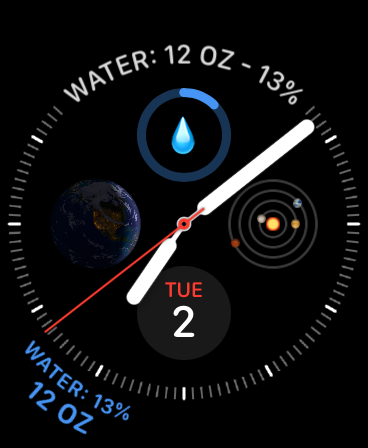
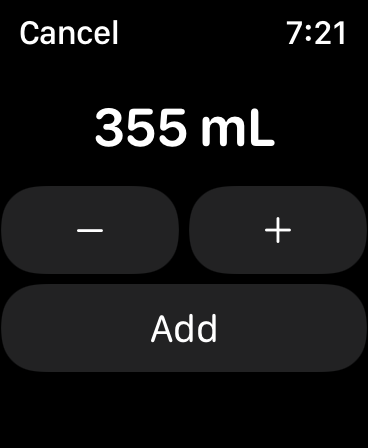

# WaterWatch
An independent watchOS app.  It's a simple water tracker that saves water consumption to HealthKit using the `dietaryWater` quantity type.

### Screenshots
A watch face with the Graphic Corner and Graphic Bezel complications for WaterWatch.

  

The summary view of WaterWatch. All information is for the current day.

  

The add-entry screen of WaterWatch.

  

Enter and view data in milliliters or fluid ounces.

