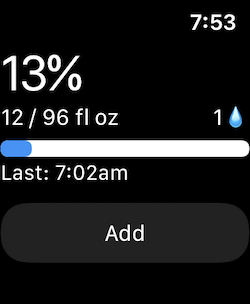

# WaterWatch
An independent watchOS app.  It's a simple water tracker.  The UI is implemented with SwiftUI... badly.  But I aspire to make it better!

A watch face with the Graphic Corner complication for WaterWatch.

The summary view of WaterWatch. All information is for the current day.

The add-entry screen of WaterWatch.

